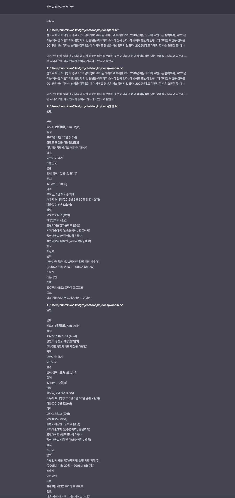

1. https://github.com/marella/chatdocs
2. https://huggingface.co/sentence-transformers/LaBSE
3. https://huggingface.co/beomi/llama-2-ko-7b



# install depdency

```
conda create -n chatdoc python=3.10
conda activate chatdoc 
pip install chatdocs==0.2.5
```

# ko

```
cd ko
chatdocs download
chatdocs add /Users/hunminko/Dev/gpt/chatdoc/ko/docs
chatdocs ui
```

# en

```
cd en
chatdocs download
chatdocs add /Users/hunminko/Dev/gpt/chatdoc/en/docs
chatdocs ui
```
